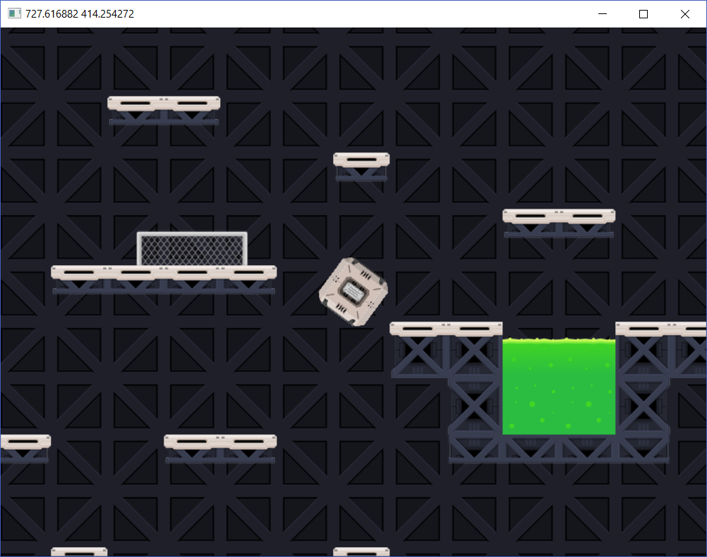

# SDLXX

[](https://travis-ci.com/egormkn/SDLXX)

[](https://ci.appveyor.com/project/egormkn/SDLXX/branch/master)

SDLXX is a library that implements a modern C++17 interface to the widely used [SDL](https://www.libsdl.org/) library and its addons: [SDL_image](https://www.libsdl.org/projects/SDL_image/), [SDL_mixer](https://www.libsdl.org/projects/SDL_mixer/), [SDL_net](https://www.libsdl.org/projects/SDL_net/), [SDL_ttf](https://www.libsdl.org/projects/SDL_ttf/). It is designed to provide a type-safe low-level access to audio, keyboard, mouse, joystick, network and graphics hardware.

## Examples

Here is an example of the [game](https://github.com/egormkn/SDLXX/releases) created using SDLXX:



## Alternatives

There are some other projects on Github that aim to provide a similar functionality. Here are some examples:

- [SDL2pp](https://github.com/libSDL2pp/libSDL2pp)
- [sdl++](https://github.com/tcbrindle/sdlxx)

## Development

Install IDE (VSCode or CLion preferred), Git, CMake 3.15+, vcpkg

### VSCode setup

1) Clone the repository, open it in VSCode and install all suggested extensions.

2) Go to VSCode preferences and set these parameters filling the vcpkg path:

   ```json
   {
     "C_Cpp.clang_format_fallbackStyle": "Google",
     "C_Cpp.default.configurationProvider": "vector-of-bool.cmake-tools",
     "cmake.configureSettings": {
         "CMAKE_TOOLCHAIN_FILE": "PATH_TO_VCPKG_CMAKE_TOOLCHAIN_HERE"
     }
   }
   ```

3) Open CMake menu, right-click SDLXX/app/testgame/SDLXX_game and choose "Run in terminal".

### CLion setup

1) Clone the repository, open it in CLion.

2) Go to `CLion settings -> Build -> CMake` and add to CMake options:

   `-DCMAKE_TOOLCHAIN_FILE=PATH_TO_VCPKG_CMAKE_TOOLCHAIN_HERE`

## License

Copyright (C) 2019 Egor Makarenko

This software is provided 'as-is', without any express or implied warranty. See our [LICENSE](LICENSE) file for more information.
